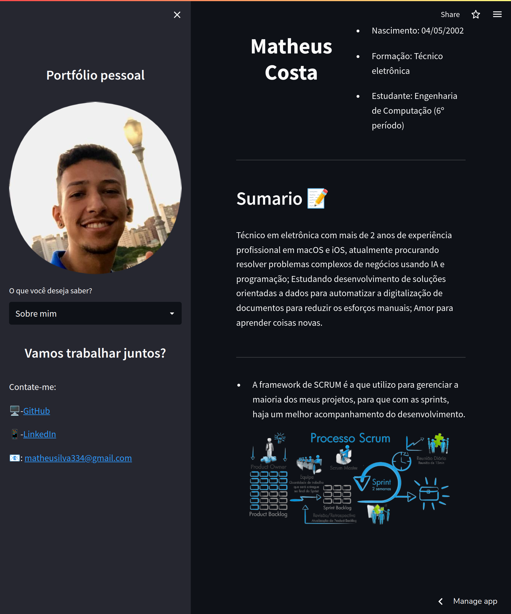

# Portfolio pessoal

## Preview do site

Projeto construído para aprimorar meus conhecimentos com a biblioteca streamlit e facilitar o acesso para meus projetos e trabalhos.

> Atributos das funções:
> - sumary(): Carrega as informações da primeira página;
> - edu(): Carrega as informações da carreira;
> - explicacao(): Carrega as informações do expander;
> - ferramenta(): Carrega as informações de habilidades/ ferramentas

> to run: python3 -m streamlit run apresentacao.py

> or: streamlit run apresentacao.py

## ⚒️ Tecnologias

- Python
- Streamlit
- CSS
- Git e GitHub

[🔗 Clique aqui para acessar o site](https://myportfoliomsc.herokuapp.com/)

## Contato

matheusilva334@gmail.com
